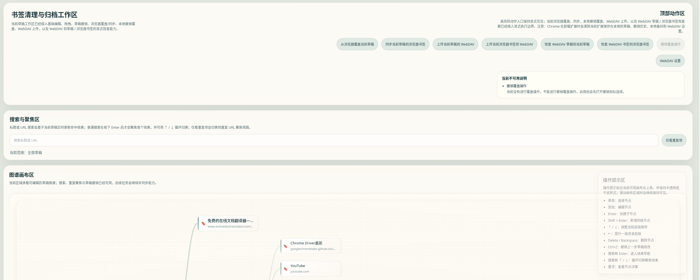

# 浏览器书签清理与归档器


**Enterprise-grade bookmark management for power users**

*Transform chaotic browser bookmarks into an organized, version-controlled knowledge graph*

---

## 概述

面向重度浏览器用户的 Chrome 书签整理工作区。项目将浏览器书签转换为可编辑的草稿图谱，让用户在安全的草稿层完成结构整理、重复 URL 聚焦、版本化归档和显式写回。

它不是一个简单的书签列表 UI，而是一个围绕**"可视化整理、可撤销覆盖、可审计同步"**设计的扩展型工作台：编辑先进入草稿，外部写操作必须确认，覆盖前自动保留本地备份，云端版本交给用户自有 WebDAV 保存。

## 项目预览



## 产品定位

浏览器原生书签管理适合保存链接，但不适合长期治理大量书签。本项目面向的是更复杂的真实场景：

| 痛点 | 影响 | 我们的解决方案 |
|------|------|----------------|
| 书签数量增长后，层级结构变得难以理解 | 信息检索效率下降 | 可视化图谱呈现，支持拖拽整理 |
| 重复 URL 分散在不同目录中 | 人工排查成本高 | 智能重复检测与聚焦 |
| 大范围拖拽、删除、重命名存在误操作风险 | 数据丢失风险 | 草稿优先编辑，显式确认机制 |
| 浏览器本地书签缺少版本归档能力 | 无法回溯历史状态 | WebDAV 版本化归档与恢复 |
| 同步或恢复这类高风险动作需要明确边界 | 静默操作导致意外 | 覆盖前备份，显式副作用模型 |

本项目的解法是把浏览器书签抽象成**"可编辑草稿图谱"**，让整理过程与浏览器真实书签解耦；只有当用户确认后，才把草稿覆盖写回浏览器或同步到 WebDAV。

## 核心能力

### 编辑与整理

| 能力 | 说明 |
|------|------|
| **草稿优先编辑** | 浏览器书签导入为规范化草稿图谱，新增、编辑、移动、删除默认只影响草稿 |
| **图谱化整理** | 使用 mindmap 风格画布呈现层级结构，支持拖拽移动、键盘重排、层级提升 |
| **节点编辑** | 支持目录 / 书签两类节点；目录编辑标题，书签编辑标题和 URL |
| **搜索与聚焦** | 支持标题 / URL 搜索、键盘结果导航、重复 URL 分组聚焦 |
| **草稿撤销** | `Ctrl+Z` 只撤销草稿编辑，不混淆浏览器写回或 WebDAV 恢复 |

### 同步与备份

| 能力 | 说明 |
|------|------|
| **浏览器覆盖** | 支持从浏览器覆盖当前草稿，也支持将当前草稿同步回浏览器书签 |
| **本地备份** | 覆盖草稿或浏览器书签前，自动保存对应对象的本地最新备份 |
| **撤销覆盖** | 可从本地备份撤销最近一次对草稿或浏览器书签的覆盖 |

### 云端归档

| 能力 | 说明 |
|------|------|
| **WebDAV 归档** | 草稿快照和浏览器书签快照分开上传、分开索引、分开恢复 |
| **版本保留** | WebDAV 每类默认保留最近 5 个版本，并维护 `index.json` 恢复列表 |

## 工程亮点

### 清晰的业务边界

项目把**"浏览器真实书签"**和**"当前可编辑草稿"**严格分开。用户在画布上的操作不会直接修改浏览器书签，降低整理过程中的破坏性风险。

### 显式副作用模型

浏览器覆盖、浏览器写回、WebDAV 上传、WebDAV 恢复、撤销覆盖都被视为**外部副作用**。每个高风险动作都经过确认、前置检查、状态记录和失败收口。

### 可回滚的浏览器写入

同步草稿到浏览器或恢复 WebDAV 书签时，系统会先读取当前浏览器书签并生成本地备份。写入失败后，适配器会执行 **best-effort rollback**，并区分普通失败、已自动回滚、自动回滚失败。

### 分层适配器设计

React 展示层不直接调用 `chrome.*`、原始 `fetch` 或本地存储接口。浏览器 API、WebDAV 协议和本地持久化都收敛在 **adapter / application 层**，便于测试、替换和扩展。

### 文案与交互集中管理

用户可见中文文案集中维护，工作区动作、状态反馈、禁用原因和确认弹窗保持统一口径，为后续多语言扩展保留空间。

## 当前实现状态

当前仓库已经进入真实业务实现阶段：

| 模块 | 状态 | 说明 |
|------|------|------|
| **扩展基础** | ✅ 已完成 | Chrome MV3 manifest、service worker、独立扩展页面 |
| **启动恢复** | ✅ 已完成 | 本地草稿恢复、浏览器书签首次导入 |
| **图谱编辑** | ✅ 已完成 | 草稿图谱、节点编辑、拖拽、键盘操作、搜索、重复聚焦、draft-only undo |
| **浏览器同步** | ✅ 已完成 | 浏览器读取、导入、导出、受管范围写回和失败回滚 |
| **本地持久化** | ✅ 已完成 | 草稿会话、undo history、状态历史、WebDAV 配置、权限状态和本地备份 |
| **WebDAV 归档** | ✅ 已完成 | 可用性检测、上传、版本保留、草稿恢复、浏览器书签恢复 |
| **测试覆盖** | ✅ 已完成 | 主要业务链路已有单元测试和组件测试覆盖 |

> **注意**：发布前仍需要在真实 Chrome 扩展环境、真实浏览器书签数据和真实 WebDAV provider 上完成最终人工验收。

## 技术栈

| 分类 | 技术 | 版本 | 说明 |
|------|------|------|------|
| **UI 框架** | React | 19 | 用户界面构建库 |
| **类型系统** | TypeScript | 5.8 | 静态类型检查 |
| **构建工具** | Vite | 6.2 | 下一代前端构建工具 |
| **扩展平台** | Chrome Extension | MV3 | 浏览器扩展开发框架 |
| **测试框架** | Vitest + Testing Library | 3.0 | 单元测试与组件测试 |
| **代码质量** | ESLint | 9.24 | 代码规范检查 |
| **包管理** | pnpm | 10.33 | 高效的包管理器 |
| **云端存储** | WebDAV | - | 基于原生 `fetch` 的协议实现 |

## 架构概览

```text
src/
├── app/                     # 页面装配、状态入口、工作区壳层
├── adapters/                # Chrome bookmarks、本地持久化、WebDAV 协议适配
├── domain/                  # 草稿图谱领域契约与编辑逻辑
├── features/                # 浏览器同步、WebDAV、图谱工作区等应用能力
└── shared/                  # 文案、校验、共享工具

test/                        # 共享测试 fixtures / setup
docs/                        # 产品、架构、交互、数据同步、开发与测试文档
```

### 核心数据流

```text
Chrome bookmarks
  → browser adapter
  → DraftGraphSnapshot
  → editable workspace
  → explicit action
  → browser write / local backup / WebDAV version
```

## 快速开始

### 环境要求

- Node.js >= 18
- pnpm >= 10
- Chrome 浏览器

### 安装与验证

```bash
# 安装依赖
pnpm install

# 代码质量检查
pnpm lint        # ESLint 检查
pnpm typecheck   # TypeScript 类型检查

# 运行测试
pnpm test        # 单元测试与组件测试

# 构建项目
pnpm build       # 生成 dist/ 目录
```

### 加载扩展

1. 执行 `pnpm build` 构建项目
2. 打开 Chrome 浏览器，访问 `chrome://extensions`
3. 开启**开发者模式**
4. 点击**"加载已解压的扩展程序"**，选择 `dist/` 目录
5. 点击扩展图标，打开书签清理与归档工作区

## WebDAV 使用说明

WebDAV 能力使用用户自有服务，不依赖项目自建后端。

### 启用流程

1. 在工作区点击**"WebDAV 设置"**
2. 填写 WebDAV URL、用户名和密码
3. 保存配置
4. 点击**"测试可用性"**，完成配置校验、host 权限请求和连通性检测
5. 检测成功后，WebDAV 上传与恢复动作启用

### 远端数据结构

```text
bookmark-extension-data/
├── bookmarks/                    # 浏览器书签快照
│   ├── index.json               # 版本索引与元数据
│   ├── latest.json              # 最新完整快照
│   └── versions/                # 历史版本
│       └── <versionId>.json
└── drafts/                      # 草稿快照
    ├── index.json               # 版本索引与元数据
    ├── latest.json              # 最新完整快照
    └── versions/                # 历史版本
        └── <versionId>.json
```

## 文档地图

| 文档 | 说明 | 适用对象 |
|------|------|----------|
| [产品需求](./docs/PRD.md) | 产品目标、用户场景、范围与验收标准 | 产品经理、开发者 |
| [技术架构](./docs/ARCHITECTURE.md) | 系统边界、分层结构、关键约束与当前实现快照 | 开发者、架构师 |
| [数据与同步](./docs/DATA-AND-SYNC.md) | 草稿真相、持久化、浏览器写回、WebDAV 版本化与恢复规则 | 开发者 |
| [界面与交互](./docs/UI-INTERACTION.md) | 工作区布局、动作入口、图谱交互、状态反馈与视觉方向 | 设计师、开发者 |
| [开发文档](./docs/DEVELOPMENT.md) | 工程入口、实现落点、约束、环境变量与开发流程 | 开发者 |
| [测试与验证](./docs/TESTING.md) | 自动化验证矩阵、测试覆盖、人工验收边界与高风险检查项 | 测试工程师、开发者 |

## 质量基线

提交前至少记录以下结果为 `pass / fail / not run`：

| 检查项 | 命令 | 说明 |
|--------|------|------|
| **代码规范** | `pnpm lint` | ESLint 检查 |
| **类型检查** | `pnpm typecheck` | TypeScript 类型检查 |
| **单元测试** | `pnpm test` | 单元测试与组件测试 |
| **构建验证** | `pnpm build` | 项目构建 |
| **代码质量** | `pnpm sonar` | SonarScanner 代码质量扫描 |
| **扩展验证** | 手动验证 | Chrome 扩展加载与功能验证 |
| **WebDAV 验证** | 手动验证 | WebDAV 服务连接与功能验证 |

### Sonar 配置

```bash
export SONAR_TOKEN='your-token'
pnpm sonar
```

> **安全提示**：`SONAR_TOKEN` 只能通过环境变量提供，不要写入仓库。

## 当前边界

| 边界 | 说明 |
|------|------|
| **浏览器支持** | 首版目标浏览器是 Chrome |
| **后端依赖** | 项目不包含自建账号系统、数据库、SaaS 后端或后台自动同步任务 |
| **数据安全** | WebDAV 凭据只保存在扩展本地，不进入状态文案、技术详情或测试快照 |
| **测试边界** | 自动化测试不能替代真实 Chrome 扩展加载、真实浏览器书签写回和真实 WebDAV 服务验收 |
| **设计资源** | `tmp/ui/` 仅作为设计参考，不允许直接复制进生产实现 |
